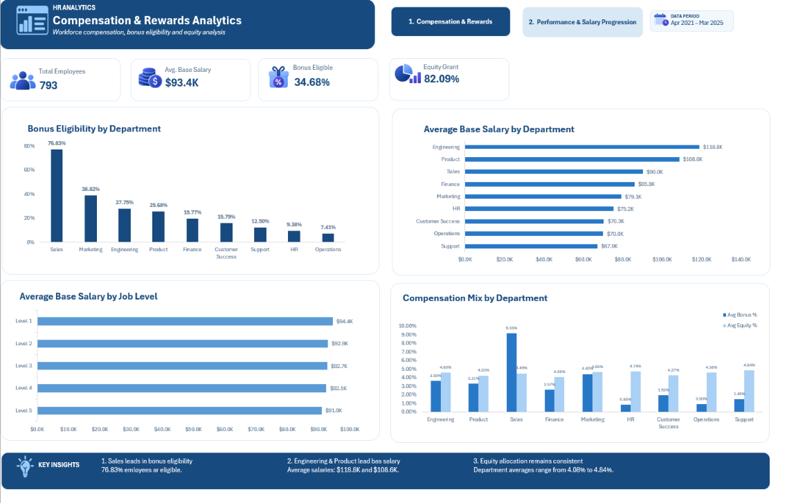
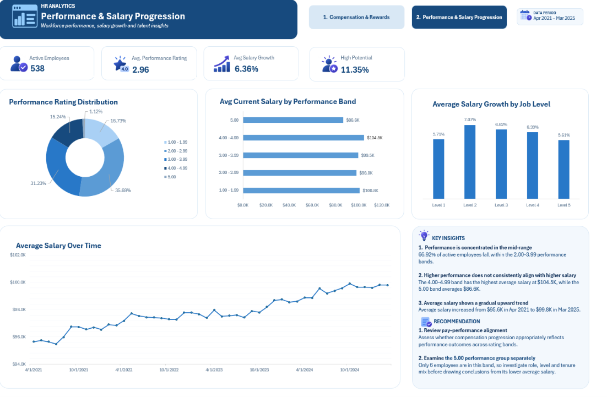

# HR Compensation, Performance & Rewards Analytics

## Project Overview

This project analyzes employee compensation, performance, rewards, and salary progression using **SQL and Microsoft Excel**.

The analysis covers workforce data from **April 2021 to March 2025** and focuses on understanding compensation structures, bonus and equity allocation, employee performance, and salary progression over time.

SQL was used for data validation, transformation, and business analysis, while Excel was used to build a two-page dashboard for presenting the final insights.

### Business Focus

**Compensation → Performance → Rewards → Salary Progression**

## Tools & Technologies

- **SQL (DuckDB)** — data validation, data quality checks, joins, CTEs, window functions, aggregations, and business analysis
- **Microsoft Excel** — dashboard development and data visualization
- **GitHub** — project documentation and version control

## Dataset

The project uses three HR datasets covering employee information, monthly workforce snapshots, and leave records.

| Dataset | Description |
|---|---|
| `employees_updated.csv` | Employee demographics, organizational information, base salary, bonus eligibility, equity allocation, and talent indicators |
| `snapshots_updated.csv` | Monthly employee snapshots including current salary, performance rating, engagement score, exit risk, and tenure |
| `leave_requests.csv` | Employee leave requests, leave types, approval status, and absence codes |

### Dataset Scope

- **793** employees in the employee master data
- **18,360** monthly employee snapshot records
- **48 monthly periods**
- Analysis period: **April 2021 – March 2025**
- **902** leave request records

## SQL Analysis & Data Validation

Before building the dashboard, the datasets were validated and analyzed in SQL to ensure data consistency and generate the required business metrics.

### Data Quality & Validation

The validation process included:

- Checking employee IDs for duplicates and missing values
- Validating salary, bonus, and equity percentage ranges
- Checking bonus eligibility and compensation consistency
- Detecting duplicate employee-month records in the snapshot data
- Validating performance, engagement, exit-risk, salary, and tenure fields
- Checking employee records across the employee master and snapshot datasets
- Reviewing leave request completeness and referential integrity
- Validating the monthly snapshot coverage across the analysis period

### Business Analysis

SQL was then used to analyze:

- Bonus eligibility by department
- Base salary differences across departments and job levels
- Bonus and equity allocation patterns
- Performance rating distribution
- Salary differences across performance bands
- Monthly average salary trends
- Individual employee salary progression
- Average salary growth by job level
- High-potential employee representation

### SQL Techniques Used

- Aggregate functions (`COUNT`, `AVG`, `SUM`, `MIN`, `MAX`)
- Conditional aggregation with `CASE WHEN`
- Common Table Expressions (CTEs)
- Window functions
- `FIRST_VALUE()` for employee salary progression
- `PARTITION BY` and `ORDER BY`
- Subqueries
- Joins and anti-join validation
- Date-based aggregation

## Dashboard Preview

The final Excel dashboard consists of two pages designed to present compensation, rewards, performance, and salary progression insights.

### 01 — Compensation & Rewards

This page provides an overview of workforce compensation and reward structures, including:

- Total employees and average base salary
- Bonus eligibility and equity grant coverage
- Bonus eligibility by department
- Average base salary by department
- Average base salary by job level
- Department-level bonus and equity allocation



### 02 — Performance & Salary Progression

This page focuses on employee performance and salary development, including:

- Active workforce and average performance rating
- Average employee salary growth
- High-potential employee representation
- Performance rating distribution
- Salary differences across performance bands
- Salary growth by job level
- Average salary trend from April 2021 to March 2025



## Key Insights

- **Sales has the highest bonus eligibility rate:** 76.83% of employees in the department are bonus eligible.
- **Engineering and Product lead base salary levels:** average base salaries are approximately $118.8K and $108.6K, respectively.
- **Equity allocation is relatively consistent across departments:** average equity percentages range from 4.08% to 4.84%.
- **Performance is concentrated in the mid-range:** 66.92% of active employees fall within the 2.00–3.99 performance bands.
- **Higher performance does not consistently correspond to higher average salary:** employees rated 4.00–4.99 have the highest average salary at approximately $104.5K, while the 5.00 group averages $86.6K. The 5.00 group contains only 6 employees, so this result should be interpreted cautiously.
- **Average salary increased gradually over the analysis period:** from approximately $95.6K in April 2021 to $99.8K in March 2025.
- **Average individual salary growth was 6.36%** among 719 employees with more than one monthly snapshot.

## Recommendations

Based on the analysis:

- **Review pay–performance alignment:** assess whether compensation progression appropriately reflects employee performance across rating bands.
- **Examine the 5.00 performance group separately:** with only 6 employees in this group, role, job level, and tenure differences should be reviewed before drawing broader conclusions.
- **Monitor compensation differences across departments:** particularly the higher base salary levels observed in Engineering and Product.
- **Review bonus allocation patterns:** Sales has substantially higher bonus eligibility than other departments, making it useful to assess how reward structures differ by function.

## Repository Structure

```text
HR-Compensation-Performance-Analytics/
│
├── data/
│   ├── employees_updated.csv
│   ├── snapshots_updated.csv
│   └── leave_requests.csv
│
├── sql/
│   └── hr_compensation_rewards_analysis.sql
│
├── dashboard/
│   └── HR_Compensation_Performance_Analytics.xlsx
│
├── images/
│   ├── compensation_rewards_dashboard.png
│   └── performance_salary_progression_dashboard.png
│
└── README.md

└── README.md
```

## Notes

- The dashboard is based on aggregated results generated through SQL analysis.
- Leave request data was validated as part of the data quality process but was not included in the final dashboard, as it falls outside the main compensation–performance–rewards analysis.
- Salary growth calculations include only employees with more than one monthly snapshot.
- The 5.00 performance band contains only 6 employees and should therefore be interpreted with caution.

## Author

**Nilufar Alakbarzadeh**  
Data Analytics Portfolio Project
